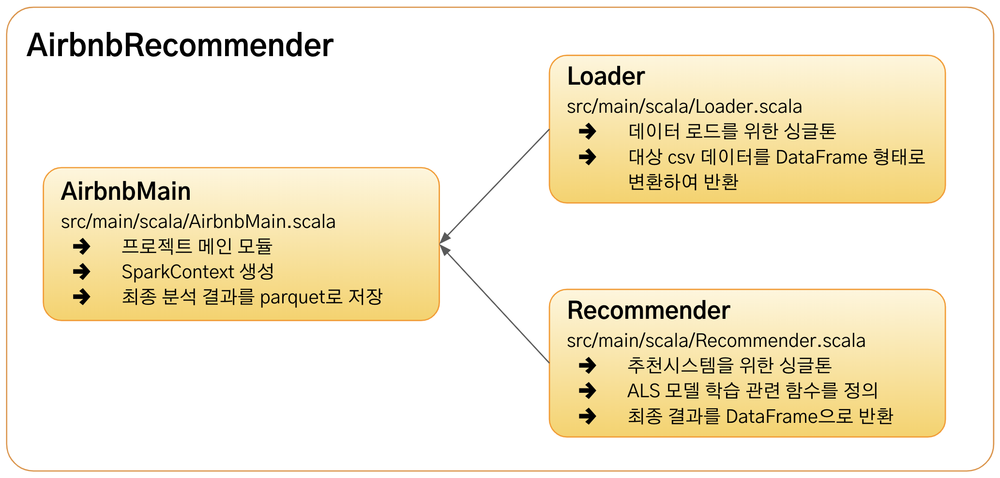
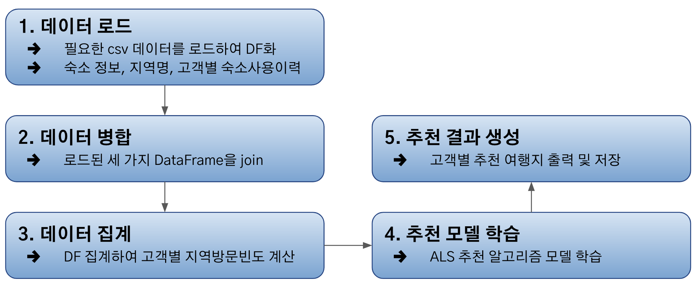
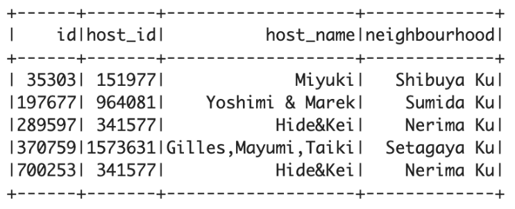
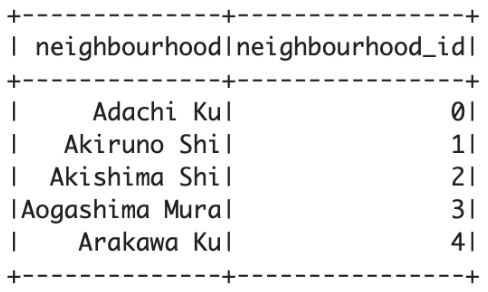
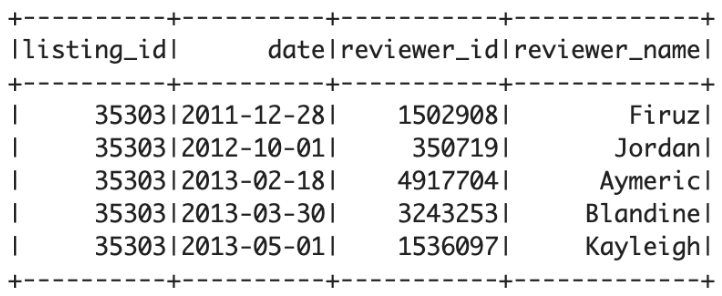
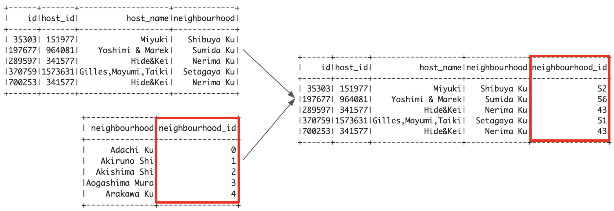
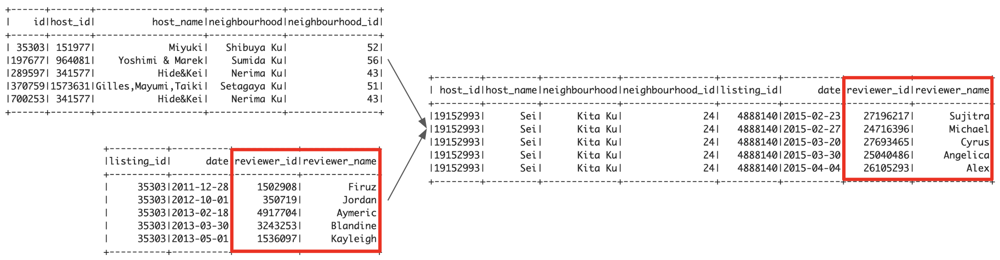
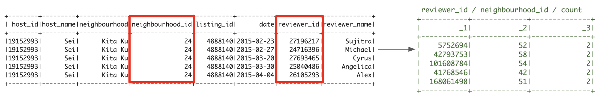
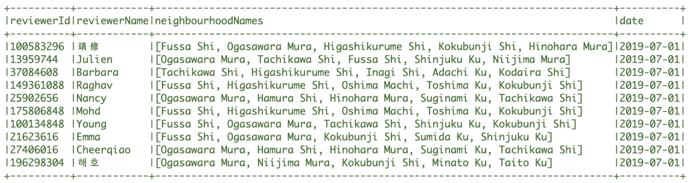

# Airbnb Recommender System with Spark

Airbnb의 공개데이터를 Spark으로 분석하여
각 고객의 여행이력을 분석하고 여행지를 추천하는 추천시스템

- data url : http://insideairbnb.com/get-the-data.html

## 1. Architecture

## 2. Workflow

## 3. Load Data

Airbnb의 공개 데이터 중 Tokyo 지역의 데이터들을 사용한다.
아래와 같이 3가지 CSV 데이터를 로드하여 DataFrame으로 변환해 사용한다.

### 3.1 숙소정보

### 3.2 지역정보

### 3.3 고객별 숙소 사용 이력

## 4. Join

숙소정보 DataFrame과 지역정보 DataFrame을 join하여
지역 ID를 갖는 DataFrame을 생성한다.

이렇게 생성한 DataFrame에 고객별 숙소 사용 이력을 join하여
사용 고객 정보를 추가한다.

## 5. Count

각 고객에 대해 어느 지역을 몇 번 방문했는지를 groupBy와 count로 집계한다.

## 6. Recommendation

Spark Mllib의 추천 알고리즘 모델(ALS)을 사용하여 고객별 여행지 추천 장소를 생성한다.
최종적으로 아래와 같은 고객별 추천 데이터를 얻을 수 있다.

